```
html 一些标签的简写方法：
 div{$}*9  --> 效果如下
    <div>1</div>
    <div>2</div>
    <div>3</div>
    <div>4</div>
    <div>5</div>
    <div>6</div>
    <div>7</div>
    <div>8</div>
    <div>9</div>
```

#### 课程收获

**前面几章内容完全可以用来复习 忘记就可以来看看**

精通现代布局四大核心技术： flex 弹性布局 grid 网格布局 响应式布局 移动端适配布局

与设计师配合：设计图相关概念、PhotoShop 切图详解、标注工具(蓝湖、PxCook)、智能平台：imgCook

实战经验: 20+常见布局方案 7 个综合案例 1 个综合项目 特殊布局案例

**课程章节安排**
CSS 还原 UI 设计 布局中的尺寸与位置
flex 弹性布局 grid 网格布局
移动端适配布局 响应式布局
综合实战 Ant Design Pro(管理系统 这个很重要)
扩展布局方案
(ant design pro 的确需要好好弄弄)

**常规网站**
一行一列 适合用弹性布局
多行多列 适合用网格布局
**移动端**
移动端 适配原则(自适应浏览器分辨率) 等比变化
一套代码在 pc 和移动端都可用(响应式布局)

#### 蓝湖 App 快速标注信息

- 蓝湖是一款设计图的共享平台，帮助互联网团队更好地管理设计图。自动生成设计图标注，与团队共享设计图，展示页面之间的跳转关系。蓝湖支持从 Sketch、Ps、Xd 一键共享、在线讨论、蓝湖已经成为新一代产品设计的工作方式

- 类似 App:measure、zeplin 等
  [蓝湖 app 地址](https://lanhuapp.com/)

#### css 盒模型的注意点

- padding 不能为负值，而 margin 可以为负值
- 背景色会平铺到非 margin 的区域(边框也会是背景色。只不过边框本身有颜色把背景色遮盖住了，如果边框为透明色，则可以看见背景色)
- margin-top 传递的现象及解决方案(margin-top 会向上传递) `见3_2 index.html` 解决办法，给父盒子加一个边框。 最好的方案，**弹性布局** **网格布局**来解决
- margin **上下叠加(左右没影响)**的现象及解决方案 `见3_2 index2.html` 叠加，取最大值 **解决方案 1：**只给一个盒子加 margin **解决方案 2：**BFC 格式化上下文。 最好方法：**弹性布局** **网格布局**来解决

(弹性布局、网格布局解决了许多很坑的 css 遗留的问题)

#### 块级盒子与内联盒子

- 块级盒子:div、p、h1 ...
- 内联盒子:span、a、strong ...

##### 块级盒子特性

- 独占一行
- 支持所有样式
- 不写宽度的时候，跟父容器的宽度相同
- 所占区域是矩形

##### 内联盒子特性

- 不会独占一行
- 有些样式不支持，例如: width、height 等
- 不写宽度的时候，宽度由内容决定
- 所占区域不一定是矩形(内容一长排列就可能不会太整齐了,如下面的格式)

```
   --------
-----------
------
---
```

- 内联标签之间是有空隙的(解决方法：如下)

```
// 有间隙的情况
<span></span>
<span></span>
<span></span>

// 消除间隙的方法
<span></span><span></span><span></span>
```

(上述可知，内联盒子问题是非常多的，会影响布局，所以做布局的时候，就**不要选择内联盒子**来做，**选块级盒子来做布局。内联盒子用来做修饰**)

display: 显示 block 就是块级盒子 inline 就是 内联盒子

#### 自适应盒模型的特性

- 自适应盒模型指的是，当盒子不设置宽度时，盒模型相关组成的处理方式是如何的(收缩子盒子)

#### 标准盒模型 与 怪异盒模型(IE 盒模型)

通过 `box-sizing` 来修改盒子的模型 `border-box(怪异盒模型)` 以及 `content-box(标准盒模型)`

```
content-box: width、 height -> content
border-box: width、 height -> content + padding + border
```

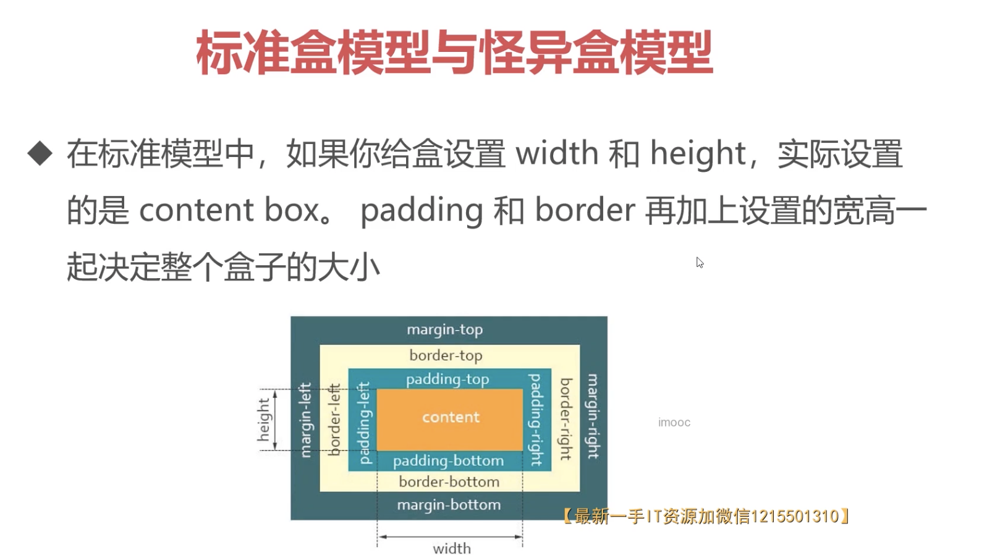
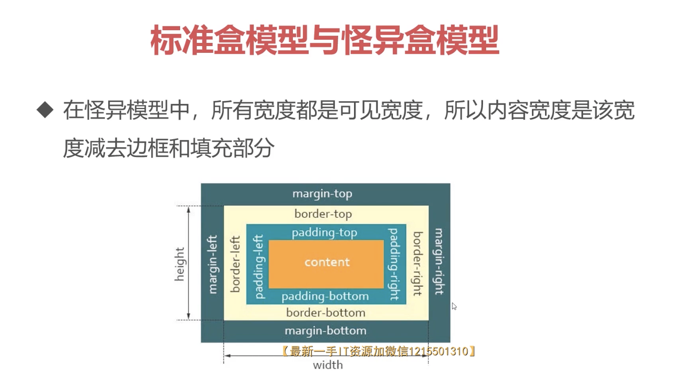

**两种盒模型的应用**

1. 应用 1: 量取尺寸时不用再去计算一些值(怪异盒模型在某些时候的优势)
2. 应用 2: 解决一些需要设置百分比和盒模型值

```
例如：

input {
  width: 100%;
  padding: 30px;   // 让宽度超过100%
}
---
<input type='text'>   // 上述情况 就会出现有滚动条情况

input {
  box-sizieng: border-box   // 解决滚动条情况 (很巧妙的用法)
  width: 100%;
  padding: 30px;
}
```

#### 浮动样式详解

- 当元素被浮动时，会脱离文档流，根据 float 的值**向左或向右(没向上或向下？)**移动，直到它的外边界碰到父元素的内边界或另一个浮动元素的外边界为止，是 css 布局中实现左右布局的一种方式

* 文档流: 文档流是元素在 Web 页面上的一种呈现方式，按照出现的先后顺序进行排列

浮动图详解：
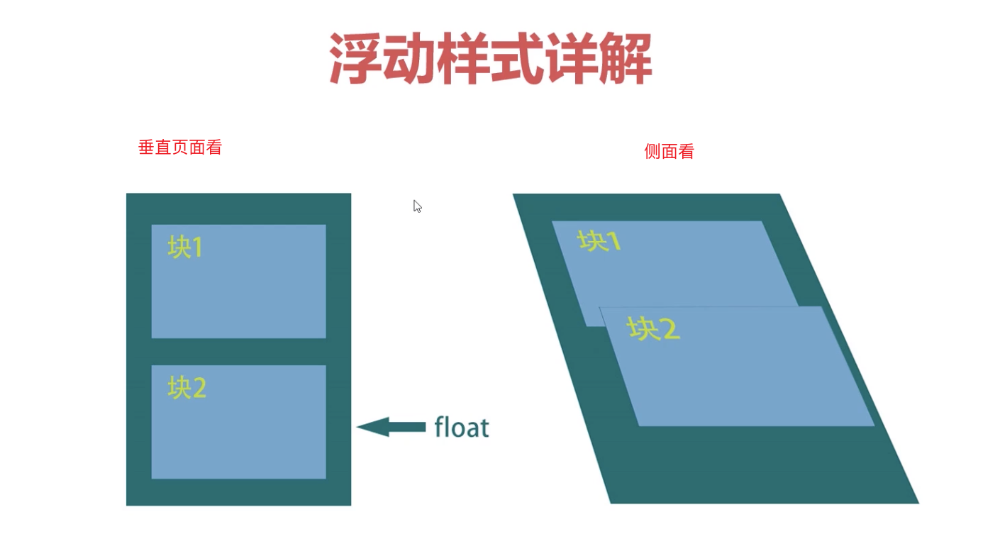
见`3-6 index1.html`

浮动后,父容器如果没设置高度，则高度会**塌陷**(因为脱离了正常的文档流)。

##### 清除浮动的方案

**视频 3-6：10 分钟左右的进度**

- clear 属性 `3_6 index2.html` 对上下关系的盒子有效果，并且只对块级盒子有效果，内联盒子没效果
- BFC
- 空标签 嵌套的盒子内部盒子仍然使用空标签 div 并 使用 clean:both 来解决
- .clearfix::after {} // 其实就是空标签的加强版

上面的布局只需了解即可。真正的弹性布局这种现代化布局，是没有上述这些问题的！

#### 浮动特性注意点

`3_7 text.html`

- 只会影响后面的元素(前面的元素不会受到任何影响)
- 文本不会被浮动元素覆盖(文字不会被浮动的盒子挡住，会围绕着浮动的盒子)
- 具备内联盒子特性: 宽度由内容决定
- 具备块级盒子特性：支持所有样式(可以加上宽高)。如果给一个内联盒子进行浮动。则也可以对内联盒子进行宽高操作
- 浮动放不下，会自动换行

#### 定位样式详解

- CSS position 属性用于指定一个元素在文档中的定位方式，其中 top、right、bottom、left 属性则决定了该元素的最终位置

position: sticky、fixed、static、relative、absolute

**相对定位及特性**

- 相对定位的元素是在文档中的正常位置偏移给定的值
- 不影响其他元素布局
- 相对于自身进行偏移

**绝对定位及特性**

- 绝对定位的元素脱离了文档流，绝对定位元素不占据空间
  (下面两点和浮动很像)
- 具备内联盒子特性：宽度由内容决定
- 具备块级盒子特性：支持所有样式
- 绝对定位元素相对于最近的非 static 祖先元素定位。当这样的祖先元素不存在时，则相对于可视区定位

**固定定位及特性**

- 固定定位与绝对定位相似，但是会固定在可视区中
- 具备内联盒子特性: 宽度由内容决定
- 具备块级盒子特性: 支持所有样式
- 固定元素不受祖先元素影响(?)

**黏性定位及特性**

- 粘性定位可以被认为是相对定位和固定定位的混合。元素在跨越特定阈值前为相对定位，之后为固定定位

**z-index**
对于嵌套盒子，父容器有 z-index，就跟父容器的 z-index 比较，否则就是子容器的 z-index 比较

### Flex 弹性布局

弹性盒子是一种用于按行或按列布局元素的 **一维布局** 方法。元素可以 **膨胀(具有弹性)** 以填充额外的空间，**收缩(具备弹性)** 以适应更小的空间

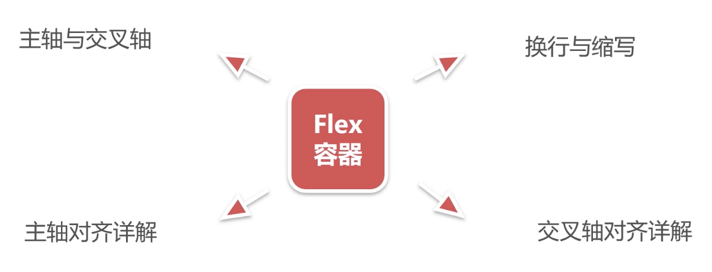
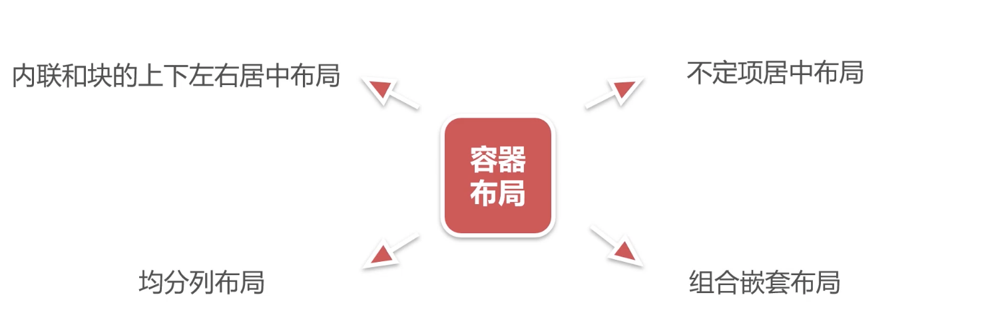
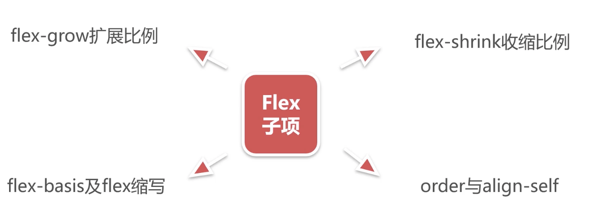
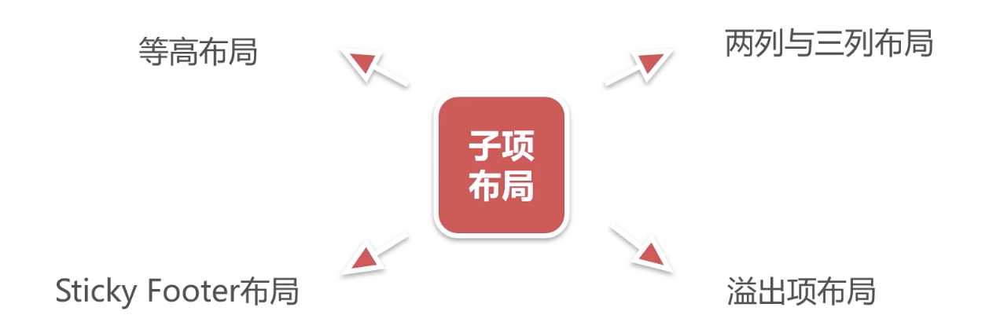

`flex`中 `flex-shrink` 和 `flex-grow` 这两个内容值得多思考思考

#### 主轴与交叉轴

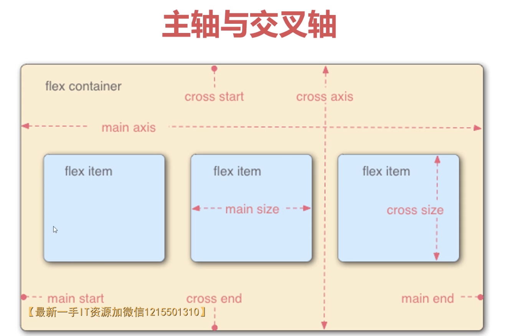

`main axis`为主轴 (从左到右)
`cross axis`为交叉轴 (从上到下)

弹性布局的说法就是因为盒子的尺寸是可以变化的

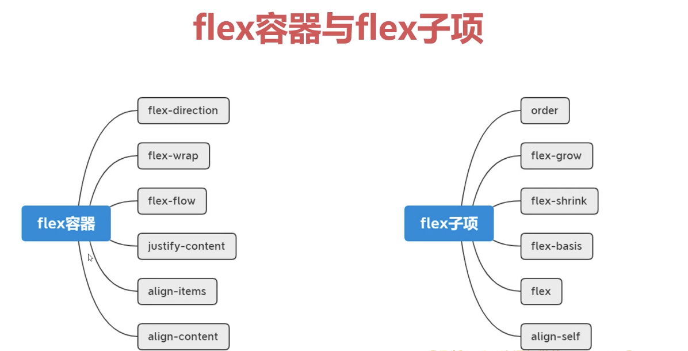

##### 改变轴方向(4_2)

`flex-direction`

```
row (默认)
row-reverse
column
column-reverse
```

##### 换行与缩写(4_3)

`flex-wrap`

```
nowrap(默认)
wrap
wrap-reverse
```

**(注意： 尽量不要让弹性布局做多行处理)**

`inline-flex`: 让父元素 内联，而子元素是弹性的

简写 `flex-direction`和`flex-wrap`:

```
flex-flow: [flex-direction][flex-wrap]
```

---

##### 主轴对齐详解(4_4)

`justify-content`

```
flex-start(默认)
flex-end
center
space-around
space-between
space-evenly
```

`justify-content` 对于自适应布局是非常友好的

##### 交叉轴对齐详解

`align-content`
(注：要让`align-content`发挥作用，必须有`flex-wrap`的搭配，有折行效果, 但似乎在不需要折行的情况下，`align-content: stretch` 就会有效果)

```
stretch(默认)
flex-start
flex-end
center
space-around
space-between
space-evenly
```

`align-items`
这一个是针对每一行的元素，而不是整体的元素(所以不需要折行效果)
(有多行子元素的效果下，才能具体看起 `align-items` 和 `align-content`的区别)

```
stretch(默认)
flex-start
flex-end
center
baseline
```

`baseline`是以小写字母 x 来做底对齐的
`flex-end`是以小写字母 y 来做底对齐的

---

##### 内联与块的上下左右居中布局

```
display: flex;
justify-content: center;
align-items: center;
```

这种居中方式的优势是可以自适应容器和子元素的大小

##### 不定项居中布局 4_7

不管是几项子元素，都可以很好的进行居中布局，这就是 flex 的优势

##### 均分列布局 4_8

##### Flex-grow 扩展比例

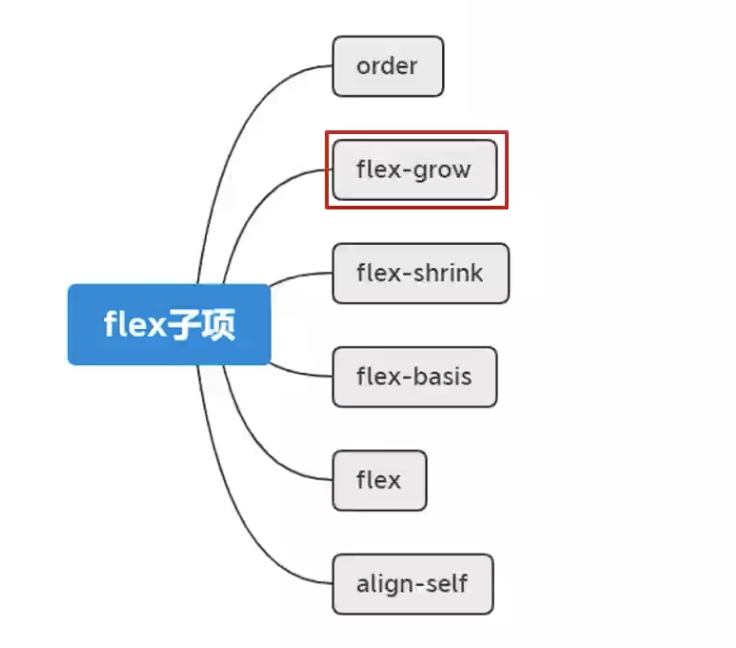

`flex-grow` 默认值是 0，表示不占用剩余的空白间隙扩展组件的宽度(值不能为负数)

##### flex-shrink 收缩比例

默认值是 1，表示 flex 容器空间不足时，元素的收缩比例
注意：多个子元素分配的收缩像素比重跟子元素本身宽度是有一定关系的

##### flex-basis 及 flex 缩写

`flex-basis` 默认值是 auto，指定了 flex 元素在**主轴**方向上的初始大小(优先级是大于子元素自身的宽度或者高度)
`flex-basis: 100% 0% auto 200px 100%`
如果是 0% 或者 auto 都是自适应文字大小

`flex`属性是`flex-grow`、`flex-shrink` 和 `flex-basis`的缩写

```
flex: 1
-->
flex-grow: 1;
flex-shrink: 1;
flex-basis: 0%;


flex: 0
-->
flex-grow: 0;
flex-shrink: 1;
flex-basis: 0%;
```

`order`: 默认值是 0，改变某一个 flex 子项的排列位置。值越大，优先级越高，排序越靠后

`align-self`: 默认值是 auto，控制单独某一个 flex 子项的垂直对齐方式。 和 `align-items`操作差不多。只不过，align-self 是针对某个元素的而 align-items 是针对整体的

> `flex` 是非常容易就能够实现传统布局的

#### 等高布局 4_13

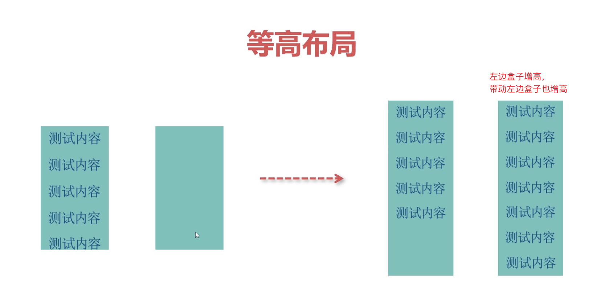
非常容易实现,因为这本就是等高布局的一个特性

#### 两列与三列布局 4_14

非常容易实现...

#### Sticky Footer 布局 4_15

父盒子 100vh 搭配 flex-grow 来实现

#### 溢出项布局 4_16

```
div{$}*8
```

只需要在子元素设置 flex-shrink: 0 注意！不是 flex-shrink:1

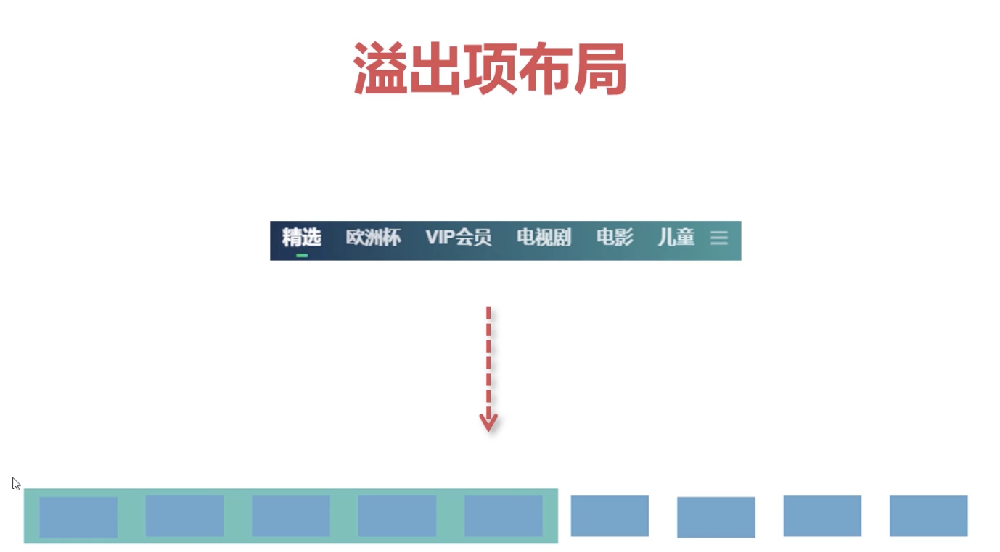

#### Swiper 轮播图

### Grid 布局

- CSS 网格是一个用于 web 的**二维布局**系统。利用网格，你可以把内容按照行与列的格式进行排版。另外，网格还能非常轻松地实现一些复杂的布局
  (网格布局搭配响应式 真的牛逼)

> flex-grow: 1 这个拉伸大法也是非常厉害的

**本章学习目的**

```

grid容器与子项： |- 定义网格及fr单位
               |- 合并网格及网格命名
               |- 网格间隙及简写
               |- 网格对齐方式及简写
               |- 显示网格与隐式网格
               |- 基于线的元素放置
               |- 子项对齐方式
               |- repeat()与minmax()

grid布局案例：
  |- 多种组合排列布局
  |- 容器自适应行列布局
  |- 栅格布局
  |- 比定位更方便的叠加布局

```

#### Grid 容器

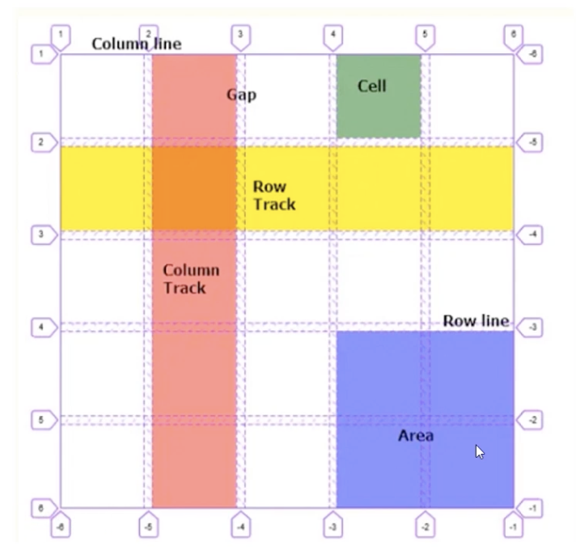

fr 是均分单位

#### grid 显示网格 和 隐式网格 这两个内容非常有意思

隐式网格是默认生成的。

```
/* 默认：row 就是行产生隐式网格 */
grid-auto-flow: row;    // 也可以换成是列的隐式网格： columns
/* 用来调节隐式网格的高度的方法 */
grid-auto-rows: 100px;
/* 用来调节隐式网格的宽度的方法 */
grid-auto-columns: 100px;

grid-column-start: 2;
grid-auto-flow: row dense;    /* dense 紧密的 */
```

#### repeat 和 auto-fill

#### minmax()方法，设置最小和最大值的范围(5-8)

> repeat auto-fill minmax() 三个方法搭配能出奇效。例如 grid-template-columns: repeat(auto-fill, minmax(100px, 150px));

#### 比定位更方便的叠加布局(5-9) (非常方便~)

让多个子元素元素占同一个网格来实现叠加效果(grid-area: 线布局),然后子元素通过 align-self 和 justify-self 来调节子元素在这个网格的位置

#### 多种组合排列布局

grid-area 来实现

#### 栅格布局(5-11) --> 这个和响应式布局是非常相关的

一般情况下，一个网页会分成 12 个栅格或者 24 个栅格
grid-area: auto/auto/auto/span 1~12;

#### 容器 自适应布局(5-12) grid + 自适应 简直王炸

列自适应是浮动做不了的。而 grid 做是非常方便的

```
display: inline-grid;  // 表示容器有inline特性，根据内容做自适应
grid-auto-flow: column;
```

#### 移动端适配概念

- 随着移动互联网的发展，移动端布局显得非常的重要。移动端布局并不复杂，主要是实现各种设备的等比适配，让所有移动端设备看起来是相同的。
- rem 布局方案：

  - 移动端 rem 布局原理解析
  - 动态计算 font-size
  - 测量 rem 数值及插件使用
  - rem 综合案例: 网易移动端

- vw 布局方案
  - 移动端 vw 布局及插件使用
  - vw 综合案例：B 站移动端

其他： 移动端概念及 UI 设计稿尺寸(图文)

#### 移动端 rem 布局原理解析

#### 移动端 vw 布局及插件使用

- vsCode 工具中的 px-to-vw 插件

#### 媒体查询语法详解

```

媒体查询
    |--媒体类型
    |    |--媒体类型(Media types) 描述设备的一般类别
    |    |--all：适用于所有设备
    |    |--print：适用于在打印预览模式
    |    |--screen：主要用于屏幕
    |    |--speech：主要用于语音合成器
    |--媒体特性
    |    |--媒体特性(Media features) 描述了user agent、输出设备，或是浏览环境的具体特征
    |    |--width：viewport的宽度
    |    |--height：viewport的高度
    |    |--aspect-ratio：viewport的宽高比
    |    |--orientation：viewport的旋转方向
    |--逻 辑操作符
    |    |--逻辑操作符(logical operators) not, and 和 only 可用于联合构造复杂的媒体查询
    |    |--and：用于将多个媒体查询规则组合成单条媒体查询
    |    |--not：用于否定媒体查询，如果不满足这个条件则返回true，否则返回false
    |    |--only：用于旧版浏览器识别媒体类型使用
    |    |--逗号：用于将多个媒体查询合并为一个规则
    |--link标签方式
```

#### 响应式布局概念

- 指网页能自动识别屏幕宽度、并做出相应调整的网页设计。响应式布局可以为不同终端的用户提供更加舒适的界面和更好的用户体验
  中小型项目 推荐用一套代码既可以针对 pc 端又可以用在移动端。这就是响应式布局。 主要就是针对不同分辨率的操控

```
响应式布局相关语法：
    |---媒体查询语法详解
    |---媒体查询的编写位置及顺序
    |---响应式栅格系统
    |---响应断点(阈值)的设定

其他
 |--响应式交互实现
 |--响应式框架 bootstrap(图文)
 |--响应式综合案例：Ghost博客
 |--测试题与练习题
```

#### 媒体查询的编写位置及顺序

建议媒体查询都写在样式表的后面，这样方便实现媒体样式覆盖效果

- 添加到样式表的底部，对 css 进行优先级的覆盖
- 移动端 -> PC 端的适配原则：min-width 从小到大
- PC 端 -> 移动端的适配原则：max-width 从大到小

**响应式**比较推荐的是移动优先的写法

#### 响应断点(阈值)的设定

- Extra small < 576px
- Small >= 576px, -sm
- Medium >= 768px, -md
- Large >= 992px, -lg
- X-Large >= 1200px, -xl
- XX-Large >= 1400px, -xxl

#### 响应式栅格系统(栅格系统 + 响应式 简直无敌)

- 栅格布局 + 断点设定

#### 响应式交互实现

- 利用:checked 伪类(checked + label 的组合)
- 利用 js 脚本

- 一般使用::after、::before 的话, 相对定位和绝对定位要好好掌握掌握

**一般一个项目 都是多种布局混合起来而非单单只使用一个布局或两个布局**

flex-shrink、flex-grow 这两块内容有点忘了~
`>`效果

自定义滚动条

> transform: scale(1.5) 这个也是用得非常好的

> line-height 的用法

> 响应式 + grid 简直无敌
